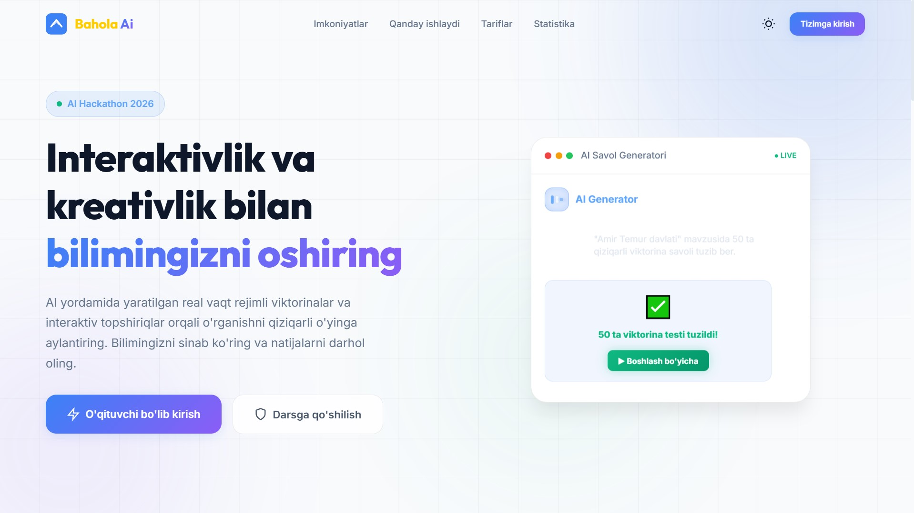
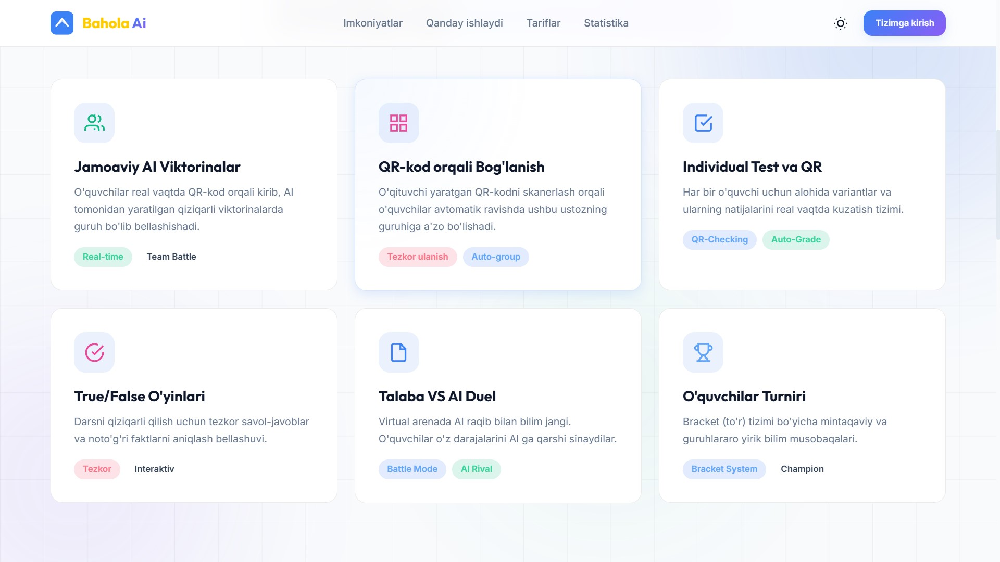
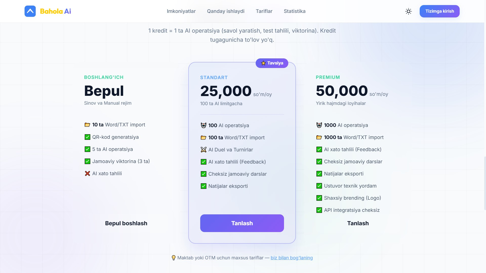

# Bahola Ai — Zamonaviy Ta'lim Platformasi 🚀

**Bahola Ai** — o'qituvchilar va talabalar uchun mo'ljallangan, sun'iy intellekt (AI) asosida ishlovchi interaktiv test va viktoriya platformasi. Ushbu loyiha dars jarayonini qiziqarli o'yin (gamification) shakliga keltirish va bilimlarni real vaqt rejimida baholash uchun yaratilgan.

## ✨ Asosiy Imkoniyatlar

- **🤖 AI Savol Generatori:** Har qanday mavzu bo'yicha soniyalar ichida sifatli testlar va viktorinalar yaratish.
- **📱 Real-vaqt Rejimi:** Talabalar o'z mobil qurilmalari orqali QR-kod yordamida darsga ulanib, real vaqtda bellashadilar.
- **📊 Jonli Statistika:** O'qituvchi ekranda kim qanday natija ko'rsatayotganini va guruhlarning umumiy reytingini jonli kuzatadi.
- **👥 Jamoaviy Bellashuvlar:** Talabalarni guruhlarga bo'lib, jamoaviy intellektual o'yinlar tashkil qilish.
- **📝 Word/TXT Import:** Tayyor hujjatlardan testlarni tizimga oson ko'chirib o'tkazish.

## 📸 Platformadan Ko'rinishlar

### 1. Asosiy sahifa (Hero section)
Platformaning umumiy ko'rinishi va interaktiv elementlari.


### 2. Imkoniyatlar va Funksiyalar
Platforma taklif etadigan barcha zamonaviy yechimlar.


### 3. Tariflar va Xizmatlar
Har xil ehtiyojlar uchun moslashtirilgan tarif rejalari.


## 🛠 Texnologiyalar

- **Frontend:** HTML5, CSS3 (Modern UI), JavaScript (ES6+)
- **Backend:** PHP 8.x
- **Database:** MySQL
- **AI Integration:** OpenAI API (GPT-4o)
- **Real-time:** AJAX / Long Polling

## 🚀 O'rnatish tartibi

1. Repozitoriyani klonlang:
   ```bash
   git clone https://github.com/USERNAME/smarteducation.git
   ```
2. Ma'lumotlar bazasini yarating va `database/db.sql` faylini import qiling.
3. `api/config/` papkasidagi shablonlardan foydalanib sozlamalarni kiriting:
   - `database.sample.php` -> `database.php`
   - `openai.sample.php` -> `openai.php`
4. Serverni (OpenServer yoki Apache/Nginx) `smarteducation.local` domeniga sozlang.

---
**Muallif:** Bahola Ai Team
**Yil:** 2026
